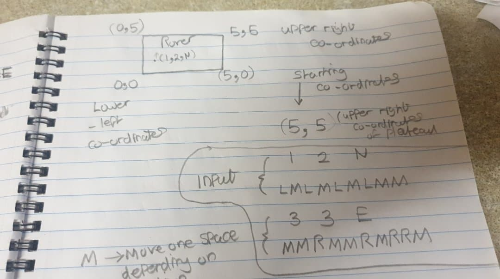
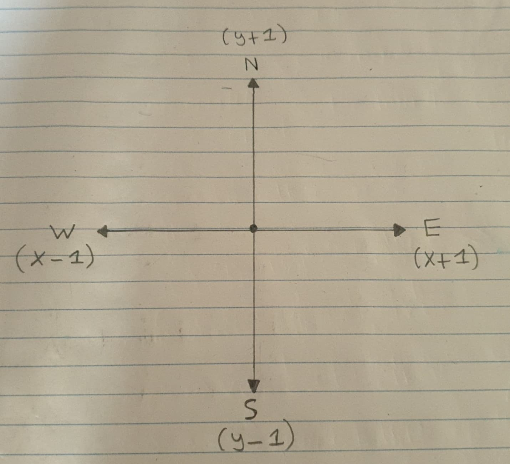

# Mars Rover Technical Challenge

**Requirements**

A squad of robotic rovers are to be landed by NASA on a plateau on Mars. This plateau, which is curiously rectangular, must be navigated by the rovers so that their on board cameras can get a complete view of the surrounding terrain to send back to Earth. A rover's position is represented by a combination of an x and y co-ordinates and a letter representing one of the four cardinal compass points. The plateau is divided up into a grid to simplify navigation. An example position might be 0, 0, N, which means the rover is in the bottom left corner and facing North. In order to control a rover, NASA sends a simple string of letters. The possible letters are 'L', 'R' and 'M'. 'L' and 'R' makes the rover spin 90 degrees left or right respectively, without moving from its current spot. 'M' means move forward one grid point, and maintain the same heading. Assume that the square directly North from (x, y) is (x, y+1).

## **Input**

The first line of input is the upper-right coordinates of the plateau, the lower-left coordinates are assumed to be 0,0. The rest of the input is information pertaining to the rovers that have been deployed. Each rover has two lines of input. The first line gives the rover's position, and the second line is a series of instructions telling the rover how to explore the plateau. The position is made up of two integers and a letter separated by spaces, corresponding to the x and y co-ordinates and the rover's orientation. Each rover will be finished sequentially, which means that the second rover won't start to move until the first one has finished moving.

## **Output**

The output for each rover should be its final co-ordinates and heading.

## **Test Input:**

5 5

1 2 N

LMLMLMLMM

3 3 E

MMRMMRMRRM

## **Expected Output:**

13N

51E

# Preparation






# User Stories

# Running the program in irb

$ git clone https://github.com/Thatguy560/mars-rover.git

$ cd mars-rover

$ run bundle in Commandline (To install all the dependencies)

$ Type irb in Commandline

$ require './lib/Rover.rb'

$ Instantiate a new instance of the Rover class with any coordinates and direction of your choice e.g. rover = Rover.new(3, 3, "E")

$ To move the rover type in - rover.move("M")

$ To make the rover turn left type - rover.turn("L")

$ To make the rover turn right type - rover.turn("R")

$ To check the rovers co-ordinates at any time type - rover.return_coordinates

# Example Usage

```ruby
rover1 = Rover.new(1, 2, "N") #<Rover:0x00007f89e28ef558 @x=1, @y=2, @direction="N">
rover1.turn("L") #<Rover:0x00007f89e28ef558 @x=1, @y=2, @direction="W">
rover1.move("M") #<Rover:0x00007f89e28ef558 @x=0, @y=2, @direction="W">
rover1.turn("L") #<Rover:0x00007f89e28ef558 @x=0, @y=2, @direction="S">
rover1.move("M") #<Rover:0x00007f89e28ef558 @x=0, @y=1, @direction="S">
rover1.turn("L") #<Rover:0x00007f89e28ef558 @x=0, @y=1, @direction="E">
rover1.move("M") #<Rover:0x00007f89e28ef558 @x=1, @y=1, @direction="E">
rover1.turn("L") #<Rover:0x00007f89e28ef558 @x=1, @y=1, @direction="N">
rover1.move("M") #<Rover:0x00007f89e28ef558 @x=1, @y=2, @direction="N">
rover1.move("M") #<Rover:0x00007f89e28ef558 @x=1, @y=3, @direction="N">

rover2 = Rover.new(3, 3, "E") #<Rover:0x00007f89e2857ac8 @x=3, @y=3, @direction="E">
rover2.move("M") #<Rover:0x00007f89e2857ac8 @x=4, @y=3, @direction="E">
rover2.move("M") #<Rover:0x00007f89e2857ac8 @x=5, @y=3, @direction="E">
rover2.turn("R") #<Rover:0x00007f89e2857ac8 @x=5, @y=3, @direction="S">
rover2.move("M") #<Rover:0x00007f89e2857ac8 @x=5, @y=2, @direction="S">
rover2.move("M") #<Rover:0x00007f89e2857ac8 @x=5, @y=1, @direction="S">
rover2.turn("R") #<Rover:0x00007f89e2857ac8 @x=5, @y=1, @direction="W">
rover2.move("M") #<Rover:0x00007f89e2857ac8 @x=4, @y=1, @direction="W">
rover2.turn("R") #<Rover:0x00007f89e2857ac8 @x=4, @y=1, @direction="N">
rover2.turn("R") #<Rover:0x00007f89e2857ac8 @x=4, @y=1, @direction="E">
rover2.move("M") #<Rover:0x00007f89e2857ac8 @x=5, @y=1, @direction="E">

rover1.return_coordinates
"Rover co-ordinates are 1, 3 facing N"

rover2.return_coordinates
"Rover co-ordinates are 5, 1 facing E"
```

# Check Test Coverage

```ruby
Type 'bundle install' into terminal

Type 'rspec' into terminal

Test Coverage 100.00% -- 113/113 lines in 3 files

18 examples, 0 failures
```

# Testing Frameworks Used

## Rubocop, Simplecov, rspec
